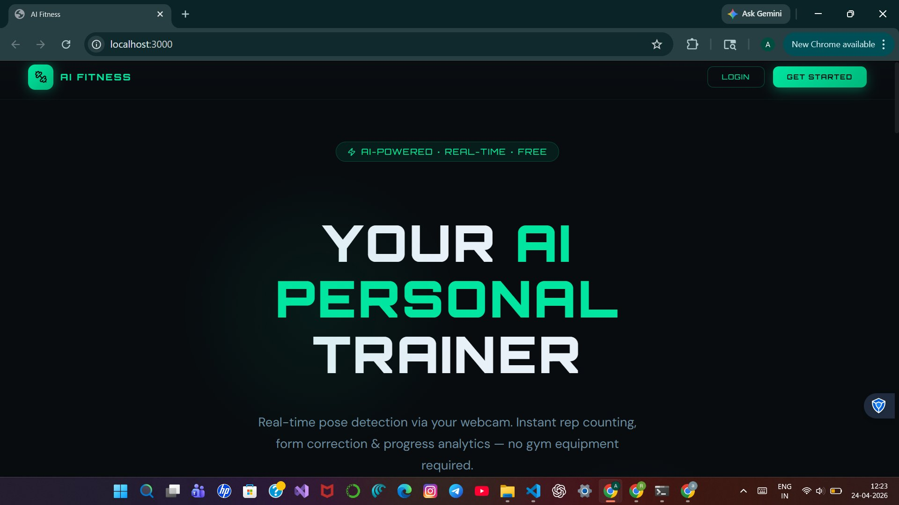
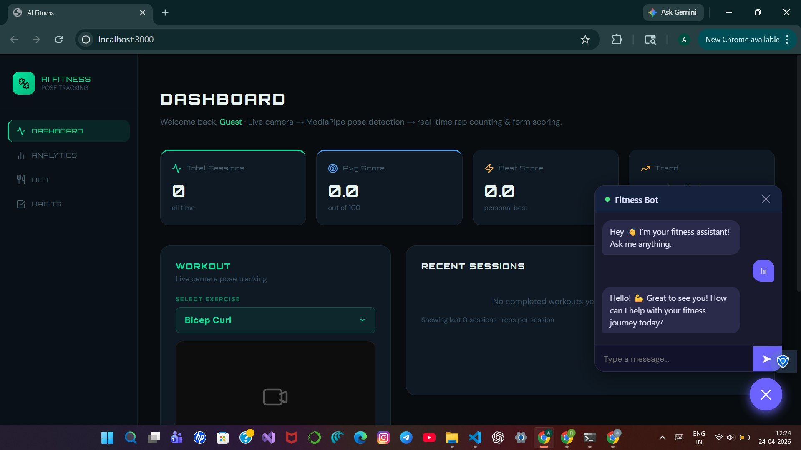
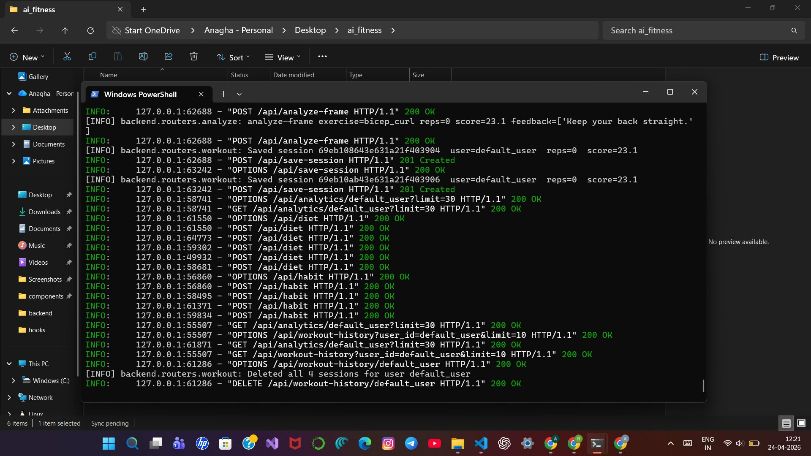

# AI Fitness Assistant
Built a real-time computer vision system that analyzes human movement and provides automated fitness feedback.

A full-stack web application for real-time workout tracking using computer vision. The system uses a live camera feed to detect body pose, count repetitions, and score exercise form — all processed in the browser and analyzed via a Python backend.

---

## Features

- **Real-time pose detection** via webcam using MediaPipe
- **Automated rep counting** for bicep curls, push-ups, and squats
- **Form scoring** with per-session feedback (0–100 scale)
- **Session persistence** — workouts saved to MySQL with duration and score
- **Analytics dashboard** — total sessions, average score, personal best, and trend tracking
- **Fitness chatbot** — keyword-based guidance for workouts, diet, and weight management

---

## Tech Stack

| Layer     | Technology                        |
|-----------|-----------------------------------|
| Frontend  | React.js, inline styles           |
| Backend   | FastAPI (Python 3.10+)            |
| AI / CV   | MediaPipe Pose, OpenCV            |
| Database  | MySQL 8.x                         |
| API Comm. | REST (JSON + multipart/form-data) |

---

## Architecture

```
Browser (React)
  └── Captures webcam frames every 1s (JPEG via canvas)
  └── POST /api/analyze-frame  →  FastAPI
                                    └── MediaPipe Pose Detection
                                    └── Rep counter + form scorer
                                    └── Returns: reps, form_score, feedback
  └── POST /api/save-session   →  FastAPI  →  MySQL
  └── GET  /api/analytics      →  FastAPI  →  MySQL  →  Dashboard
```

---

## Folder Structure

```
ai_fitness/
├── frontend/                  # React application
│   └── src/
│       ├── components/        # WorkoutCamera, Chatbot, StatCard, etc.
│       ├── pages/             # Dashboard, Analytics, Diet, Habits, Landing
│       ├── hooks/             # useWorkout (custom hook)
│       ├── context/           # AuthContext
│       └── utils/             # api.js (Axios wrappers)
│
└── backend/                   # FastAPI application
    ├── main.py                # App entry point, CORS, route registration
    ├── routes/
    │   ├── analyze.py         # /api/analyze-frame
    │   ├── sessions.py        # /api/save-session
    │   └── analytics.py       # /api/analytics
    ├── pose/
    │   ├── detector.py        # MediaPipe wrapper
    │   ├── rep_counter.py     # Angle-based rep logic per exercise
    │   └── form_scorer.py     # Form analysis + feedback generation
    └── db/
        ├── connection.py      # MySQL connection pool
        └── models.py          # Table schema definitions
```

---

## Setup Instructions

### Prerequisites

- Node.js 18+
- Python 3.10+
- MySQL 8.x running locally
- Webcam access

---

### Backend

```bash
cd backend

# Create and activate virtual environment
python -m venv venv
source venv/bin/activate        # Windows: venv\Scripts\activate

# Install dependencies
pip install -r requirements.txt

# Configure database
# Create a MySQL database named: ai_fitness
# Update connection settings in db/connection.py

# Run the server
uvicorn main:app --reload --port 8000
```

API base URL: `http://127.0.0.1:8000/api`

---

### Frontend

```bash
cd frontend

# Install dependencies
npm install

# Start development server
npm start
```

App runs at: `http://localhost:3000`

---

## API Reference

| Method | Endpoint                    | Description                        |
|--------|-----------------------------|------------------------------------|
| POST   | `/api/analyze-frame`        | Accepts JPEG frame, returns reps, form score, feedback |
| POST   | `/api/analyze-frame/reset`  | Resets rep counter for new session |
| POST   | `/api/save-session`         | Persists session data to MySQL     |
| GET    | `/api/analytics`            | Returns aggregated user statistics |

**analyze-frame request** — `multipart/form-data`
```
frame         : image/jpeg
exercise_type : "bicep_curl" | "push_up" | "squat"
```

**analyze-frame response** — `application/json`
```json
{
  "reps": 8,
  "form_score": 74,
  "feedback": ["Keep your back straight", "Full range of motion detected"]
}
```

---

## Environment Notes

- The backend must be running before the frontend can track workouts or load analytics.
- Camera access requires HTTPS in production; localhost is exempt.
- CORS is configured in `main.py` to allow `http://localhost:3000`.

---

## Screenshots

### Landing Page


### Dashboard with Analytics and Chatbot


### Backend API Logs (FastAPI + Uvicorn)


---

## Future Improvements

- **User authentication** — JWT-based login with per-user workout history
- **Additional exercises** — shoulder press, deadlift, plank hold timer
- **3D skeleton overlay** — render pose landmarks on the live video feed
- **AI chatbot upgrade** — integrate LLM API for context-aware fitness coaching
- **Mobile support** — responsive layout with rear-camera toggle
- **Export** — download session history as CSV or PDF report
- **Progressive Web App** — offline support and installable on mobile

---

## License

MIT
